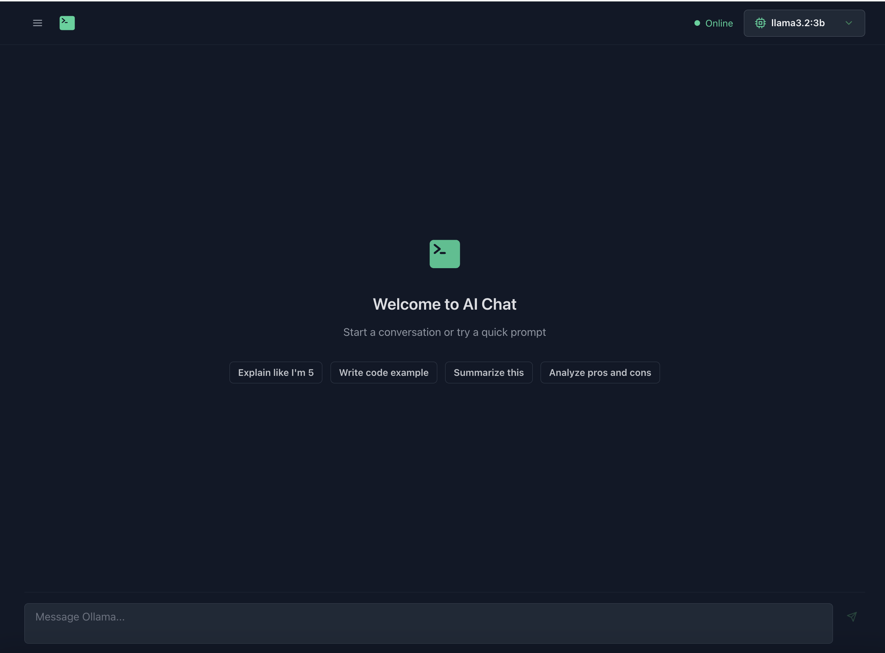

# Ollama Chat UI

A modern, responsive chat interface for Ollama, built with React, TypeScript, and Chakra UI.



## Repository

🔗 **GitHub Repository**: [https://github.com/saravanasak/ollama-chat](https://github.com/saravanasak/ollama-chat)

## Features

- 🎯 Clean and intuitive user interface
- 💬 Real-time chat with Ollama models
- 📝 Edit messages and regenerate responses
- 📚 Chat history management
- 🎨 Dark mode interface
- ⚡ Quick prompt suggestions
- 🔄 Server status monitoring

## Prerequisites

Before you begin, ensure you have the following installed:

1. **Ollama Desktop Application**
   - Visit [Ollama's official website](https://ollama.ai)
   - Download and install the appropriate version for your operating system
   - Make sure the Ollama service is running on your machine

2. **Node.js**
   - Required version: 16.x or higher
   - Download from [Node.js official website](https://nodejs.org)

## Installation

1. **Clone the repository**
   ```bash
   git clone https://github.com/saravanasak/ollama-chat.git
   cd ollama-chat
   ```

2. **Install dependencies**
   ```bash
   npm install
   ```

3. **Start the development server**
   ```bash
   npm run dev
   ```

4. **Access the application**
   - Open your browser and navigate to `http://localhost:5173`

## Setting Up Ollama Models

1. **Install models using Ollama**
   ```bash
   # Install a specific model, for example:
   ollama pull llama2
   ollama pull mistral
   ollama pull codellama
   ```

2. **Verify model installation**
   ```bash
   ollama list
   ```

## Using the Chat Interface

1. **Start chatting**
   - Select a model from the dropdown menu
   - Type your message in the input field
   - Press Enter or click the send button

2. **Features**
   - Edit messages: Click the edit icon on any user message
   - Start new chat: Click "New Chat" in the sidebar
   - View chat history: Access previous conversations from the sidebar
   - Quick prompts: Use suggested prompts for common tasks

## Troubleshooting

- **Server Status Shows Offline**
  - Ensure the Ollama service is running
  - Check if Ollama is running on the default port (11434)
  - Restart the Ollama service if needed

- **Models Not Showing**
  - Verify models are installed using `ollama list`
  - Check Ollama service status
  - Refresh the browser page

## Development

- Built with React + TypeScript
- Uses Vite for fast development
- Styled with Chakra UI
- State management with React hooks

## Contributing

Contributions are welcome! Please feel free to submit a Pull Request.

## License

This project is licensed under the MIT License - see the LICENSE file for details.
